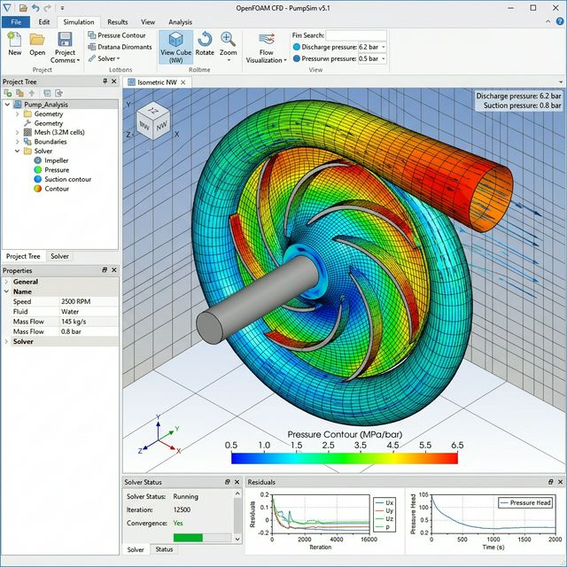

本项目围绕超高速离心泵的多物理场响应，建立从流场计算、温度传递到结构分析的顺序耦合流程。

## 1. Engineering Problem

**这个项目解决什么问题？为什么值得研究？**
在 28000 rpm 超高速及 10 MPa 增压工况下，离心泵内部流体极易产生剧烈的压力脉动与温升。流体的热量与压力载荷传递至泵体结构，容易引发热变形和应力集中，导致转子碰磨或疲劳失效。准确预测和评估这些多物理场耦合效应，对于保障高速泵的安全稳定运行至关重要。

## 2. My Role

**我具体负责什么？**
- 独立完成流道与固体结构的几何清理与网格划分。
- 搭建 CFD 与有限元分析的联合仿真流程。
- 执行从流场计算到结构响应的单向/双向流热固耦合分析。
- 提取并分析压力云图、温度场及应力分布，为结构优化提供数据依据。

## 3. Method

- **建模与网格**：前处理几何清理与高质量六面体/四面体网格划分。
- **CFD**：基于 N-S 方程的高速旋转流场计算，求解压力、速度分布及效率。
- **有限元**：应用 ANSYS Workbench 将流体侧载荷（压力、温度）精确映射至结构网格。
- **流热固耦合**：构建顺序耦合分析链路，评估热变形与结构强度。

## 4. Key Results

- 成功实现 **28000 rpm** 超高速旋转工况下的定常/非定常流动求解。
- 评估了在 **10 MPa** 极限增压下的流场边界脉动规律。
- 耦合计算表明，叶轮外缘温升与高梯度区域对整体热变形贡献显著，直接指导了径向间隙补偿设计。
- 验证了不同网格密度与湍流模型及边界条件下的结果稳定性。

## 5. Visual Evidence

*(此处为预留图位，后续将补充真实的工程视觉材料。)*
- <!-- 仿真模型图 -->
- <!-- 网格图 -->
- 
- <!-- 热变形与等效应力云图 -->

## 6. What I Learned

**遇到的问题与解决思路：**
- **载荷映射失败**：早期 CFD 与结构计算网格疏密差异过大，导致界面插值严重失真甚至求解直接中止。**解决**：统一了两场计算的坐标映射、单位制，通过优化界面层的局部网格密度，显著提高了力/热传递精度。
- **收敛性难题**：超高速工况下初始化极易发散。**解决**：合理调低松弛因子，采用了缓慢提升转速的伪阶跃启动策略。
- **下一步优化**：计划引入瞬态双向流固耦合（2-Way FSI），以更真实地捕捉流体附加质量与瞬态冲击引发的振动特性。
