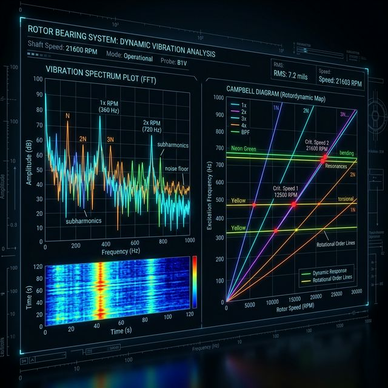

本项目来源于我的硕士学位研究，研究对象为双盘空间裂纹转子-滚珠轴承系统，目标是解释裂纹与轴承局部缺陷共存时的耦合振动特性，并建立可泛化的故障识别方法。

## 1. Engineering Problem

**这个项目解决什么问题？为什么值得研究？**
在实际旋转机械中，转子裂纹与轴承局部缺陷往往同时发生。这两者的振动特征在强噪环境中相互掩盖，频段高度耦合，难以用传统单一信号处理方法清晰剥离。深入理解两者的非线性动态耦合机理，并提出一套强泛化、多维度的智能诊断框架，对工业设备的预测性维护具有极高的研究门槛与工程应用价值。

## 2. My Role

**我具体负责什么？**
- 理论推导并数值求解空间斜裂纹与轴承表面缺陷耦合系统非线性动力学模型。
- 独立搭建转子综合故障实验测试平台，规划多工况并完成多源原始振动数据的采集。
- 开发基于 VMD-CWT 的信号处理算法，解析故障相关的深层时频特征模式。
- 构建并部署 1D-CNN 故障诊断算法框架，利用搜索算法自动化寻优模型。

## 3. Method

- **动力学建模**：有限元法与断裂力学建立刚度模型；Jones-Harris 拟静力学与双冲击接触力模型构建系统方程；利用 Newmark-β 进行大步长数值求解。
- **实验系统**：以 **8192 Hz** 采样率连续采集位移、加速度与电流等多源信号。
- **信号处理**：采用 **VMD-CWT** (变分模态分解结合连续小波变换) 实现信号联合解耦。
- **机器学习**：设计多输入通道 **1D-CNN**，集成 **Optuna/TPE** 超参数自动化寻优策略提高计算效率。

## 4. Key Results

- 理论上揭示了裂纹引发的转轴轨道重构对轴承高频冲击强度的“卸载效应”。
- 对于轴承双冲击时间间隔的识别，预测相对误差最低达 **0.34%**，极限绝大多数控制在极低的 5.5% 以内。
- 分析出在裂纹偏转角为 60° 且发生碰磨相角时，系统二倍频响应达到极大值点。
- 所提多源结合诊断模型在跨转速、变载荷的盲测实验中，成功完成了 **99.34%** 的分类准确率指标。

## 5. Visual Evidence

*(此处为预留图位，后续将补充真实的工程视觉材料。)*
- <!-- 仿真有限元节点模型图 -->
- <!-- 综合故障实验真实台架照片 -->
- 
- <!-- 频谱分析与能量包络图 -->
- <!-- 1D-CNN 网络拓扑架构图 -->
- <!-- MATLAB 核心方程验证特征曲线 -->

## 6. What I Learned

**遇到的问题与解决思路：**
- **强背景噪声掩蔽问题**：早期转频、裂纹二倍频与不可避免的轴承高频冲击互相掩盖。**失败经验**：直接端到端采用 EMD 处理易出现严重模态混叠。**解决**：更换内核为 VMD，辅以 CWT 重构高分辨带尺度的时频图，清晰锁定了剥离效果。
- **跨工况的泛化性崩溃**：在变运行转速下测试时，早教期 CNN 预测率剧减。**解决**：突破单通道限制补充了关联度强的多源传感器物理信号，并启用 Optuna 取代随机搜索找到了非线性激活下的全局最优配置参数。
- **下一步优化**：研究无监督领域的域适应迁移学习，以及微带计算量限制的边缘部署转换可行性。
