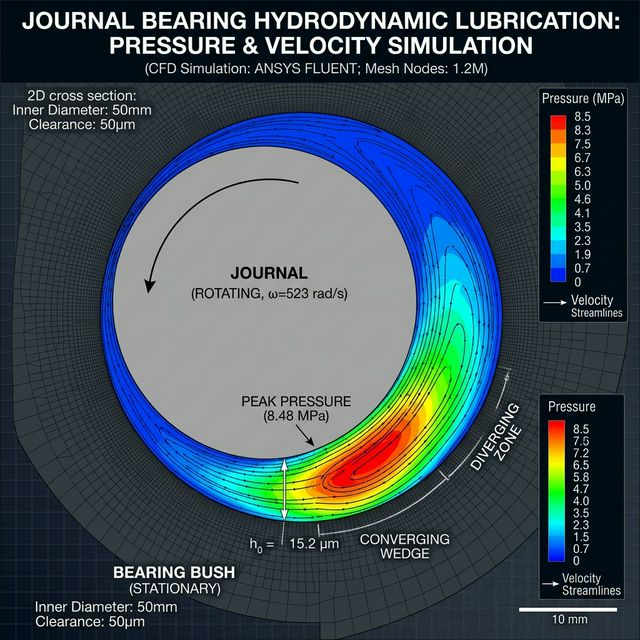

该研究面向液钠润滑动静压导轴承，重点处理转子偏心运动、流体支承力与平衡位置之间的强耦合非线性关系。

## 1. Engineering Problem

**这个项目解决什么问题？为什么值得研究？**
在核主泵与快堆液钠回路的核心旋转部件中，润滑导轴承必须承受巨大的径向突变载荷且无机械磨损寿命要求。液钠因为极低运动粘度和极高导热特性，使得此类轴承动静压的成膜及支撑情况与常温水/油膜截然两样，它的静平衡承载位与核心的线性能量参数（动刚度、动阻尼），决定了长轴转子整体能否远离共振并平稳不失稳地运行。

## 2. My Role

**我具体负责什么？**
- 针对设计图纸建立导轴承极小间隙的流体求解域，确保前应对复杂边壁条件的六面体精细网格控制。
- 分析网格移动模型并独立编写底层 Fluent C UDF 程序控制转子涡动轨迹。
- 开发转子瞬时偏心矢量寻优搜索算法实现定压工况下静平衡位置快速求解定位。
- 从复杂瞬态水动力信号辨识出不同载荷压力条件等效的交叉刚度及主阻尼。

## 3. Method

- **CFD 流体域计算**：N-S 流场与多湍流模型选择建立高速狭缝环流场。
- **动网格追踪**：使用 Fluent Dynamic Mesh 与 Spring 扩散光顺/动态重构模式控制边界与面域变形。
- **自研 UDF 控制器**：编写大量 C 代码，跨过 DEFINE_CG_MOTION 接口操纵控制网格周期扰动运动、实时监控返回宏命令提取轴瓦法向挤压力。
- **参数识别降阶**：通过平衡点附近引入的正交独立小位移与小速度扰动，获取微差下非定常激励力与对应的状态关联来拟合矩阵系数。

## 4. Key Results

- 编制交付了一套专门适配动静压轴承自动寻找偏心静平衡位置的核心 UDF 运算体系程序，使得单平衡点收敛周期得到数量级提升。
- 给出了转子速度大扫频期间各象限润滑气穴与瞬时动压流膜的力学形成机制闭环结果。
- 非常规黏度工况提取了一整套高精度 8 阵列（包含交叉轴向与直接项）的主副刚度、及阻尼矩阵系数，为后续项目中的转子及承载座稳定性转子动力学研究直接输出了基底设计边界输入。

## 5. Visual Evidence

*(此处为预留图位，后续将补充真实的工程视觉材料。)*
- <!-- 流体域精细前处理网格图 (展示近壁面加密网格) -->
- 
- <!-- Fluent UDF 数据交互与搜索流程图 (Flowchart) -->
- <!-- 基于微扰动方法解耦的系数辨识拟合散点与 MATLAB 平滑曲线图 -->

## 6. What I Learned

**遇到的问题与解决思路：**
- **极大偏心率导致的网格负体积报错中止**：微小环通域在高挤压比下会迅速畸变。**解决**：严格标定了库朗数独立性约束控制全局时间步，并深入调配重构参数（Remeshing Size）和关键节点扩散（Smoothing），让极限挤压间隙也不发生面翻转导致的发散。
- **集群计算与 UDF 并行架构数据混乱**：因为 UDF 原本基于单核逻辑，放在 HPC 站多核时节点积分总力为错误局部值。**解决**：从底层改写机制，引入 Host-to-Node 与全局 Message Passing，彻底解决了域分解后网格界面的数据不统筹。
- **下一步优化**：计划开发这套耦合仿真与系数求取的模块化批处理宏或者打包 GUI Python 插件，实现新尺寸设计时只供需填入基础参数就能无监督全周期识别交付报告流。
